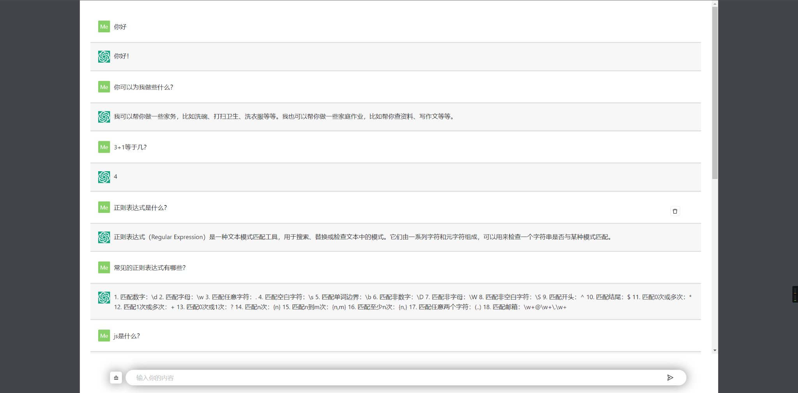

## 一个使用React开发的chatgpt的web界面
### 配合后端使用：https://github.com/coderDulu/node-chatgpt

## 开发步骤
### 1. git clone https://github.com/coderDulu/chatgpt_web.git

### 2. cd chatgpt_web

### 3. npm i 

### 4. npm start

### 5. npm build 生成静态文件：dist目录

### 效果图：
